<p align="center">
  
</p>

<h1 align="center">Signal Ledger</h1>

<p align="center">
  <strong>Auditable stock-probability research in a calm, local workspace.</strong>
</p>

<p align="center">
  <a href="docs/operations/getting-started.md">Get started</a>
  ·
  <a href="docs/usage/dashboard.md">User guide</a>
  ·
  <a href="docs/reference/api.md">API reference</a>
  ·
  <a href="MVP-PLAN.md">Product plan</a>
</p>

Signal Ledger is the product name for **Stock Probability**, a local Linux application for
exploring selected Yahoo Finance stocks and ETFs. It turns bounded provider data into explicit
forecast probabilities, intervals, provenance, and an immutable research history that you can
reopen and inspect later.

The app runs on your machine, stores its state locally in SQLite, and serves browser data through
one loopback FastAPI boundary. It is designed for research and auditability. It does not place
orders, connect to a brokerage, promise real-time delivery, or fabricate market depth.

## Screenshots

The interface keeps the overview and research surfaces quiet, then makes probabilities and
provider context easy to scan in the forecast and market tools. These screenshots use the
deterministic fixture provider so the states are repeatable; they are representative views of the
eight current routes.

<p align="center">
  <a href="docs/images/readme/forecast-result-desktop.png">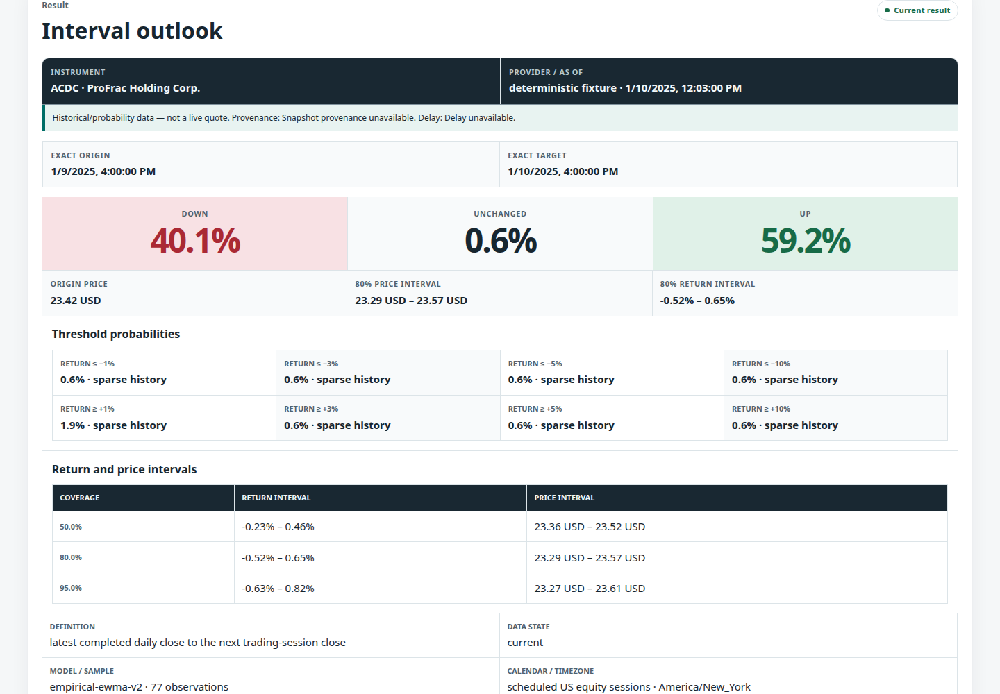</a>
</p>

<p align="center"><em>A populated forecast result keeps probabilities, intervals, provenance, and quality context together.</em></p>

### Desktop

<table>
  <tr>
    <th>Dashboard</th>
    <th>Overview</th>
    <th>Research</th>
    <th>Tools</th>
  </tr>
  <tr>
    <td><a href="docs/images/readme/dashboard-desktop.png">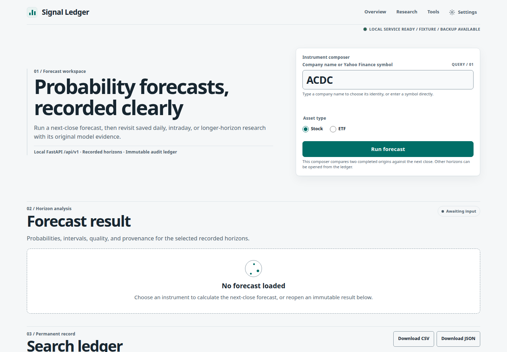</a></td>
    <td><a href="docs/images/readme/overview-desktop.png">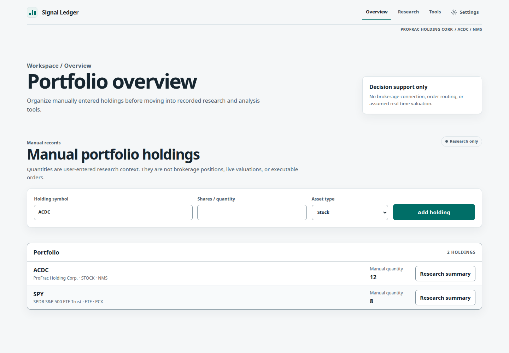</a></td>
    <td><a href="docs/images/readme/research-desktop.png">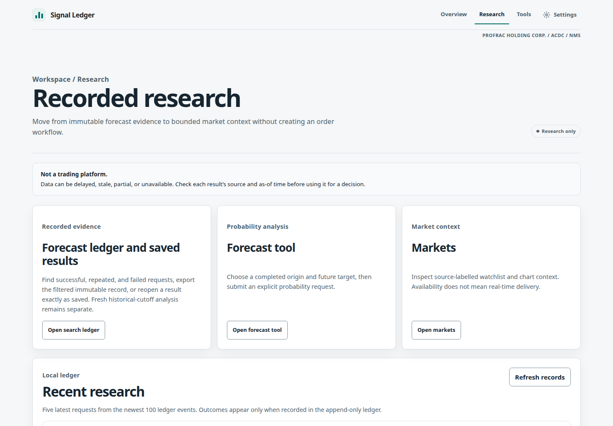</a></td>
    <td><a href="docs/images/readme/tools-desktop.png">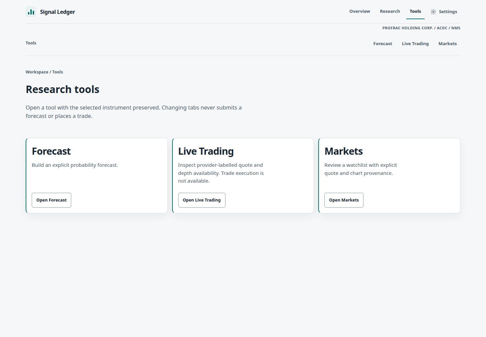</a></td>
  </tr>
  <tr>
    <th>Forecast</th>
    <th>Live Trading</th>
    <th>Markets</th>
    <th>API Docs</th>
  </tr>
  <tr>
    <td><a href="docs/images/readme/forecast-desktop.png">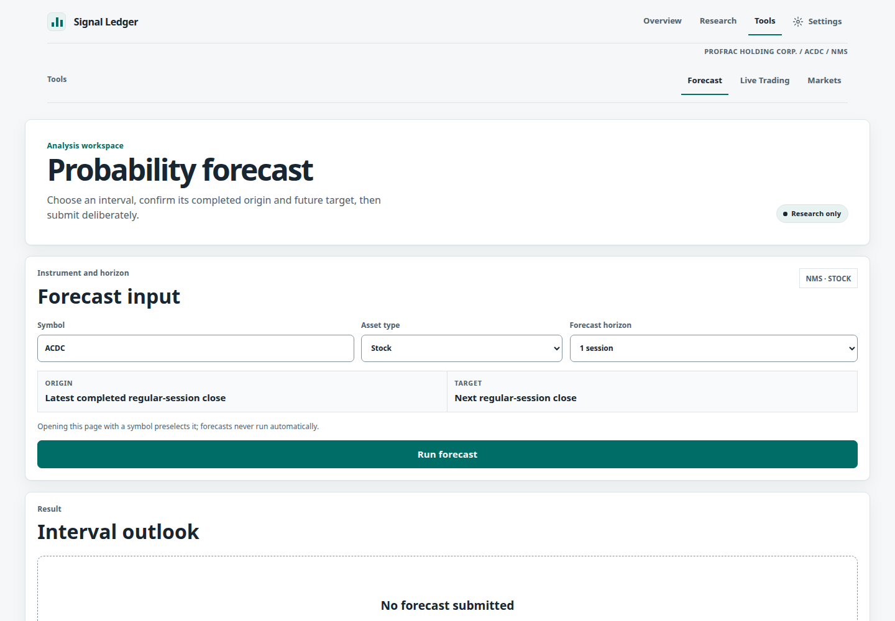</a></td>
    <td><a href="docs/images/readme/live-trading-desktop.png">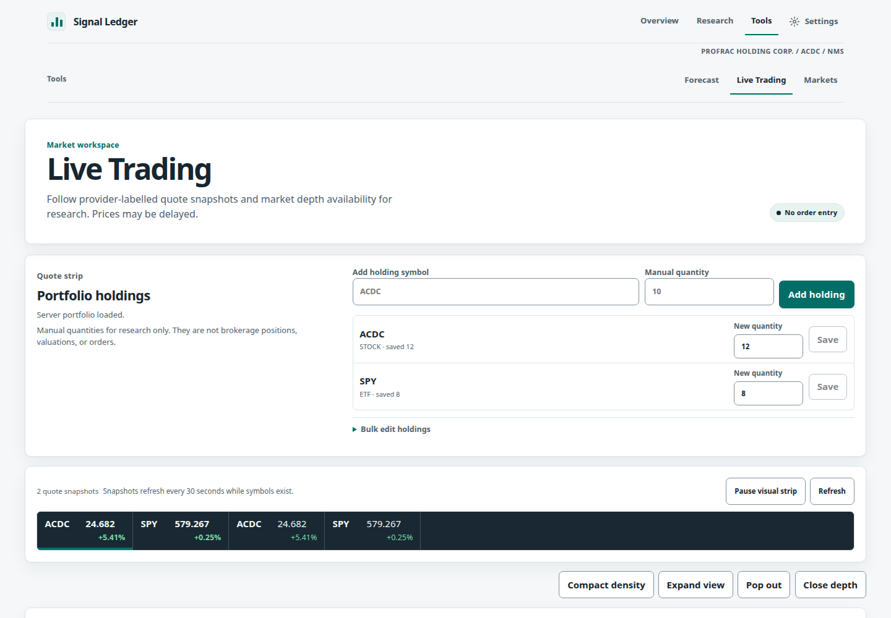</a></td>
    <td><a href="docs/images/readme/markets-desktop.png">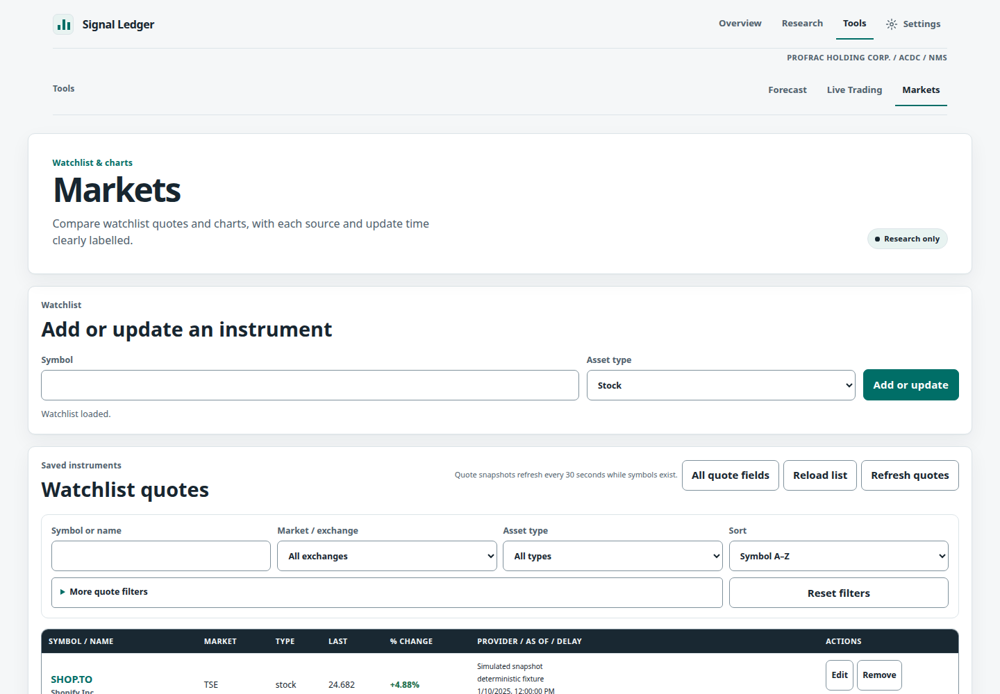</a></td>
    <td><a href="docs/images/readme/api-docs-desktop.png">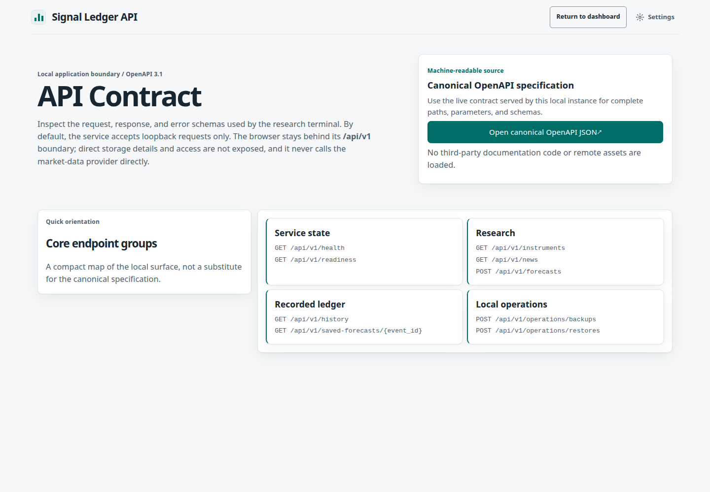</a></td>
  </tr>
</table>

### Mobile

<table>
  <tr>
    <th>Dashboard</th>
    <th>Overview</th>
    <th>Research</th>
    <th>Tools</th>
  </tr>
  <tr>
    <td><a href="docs/images/readme/dashboard-mobile.png">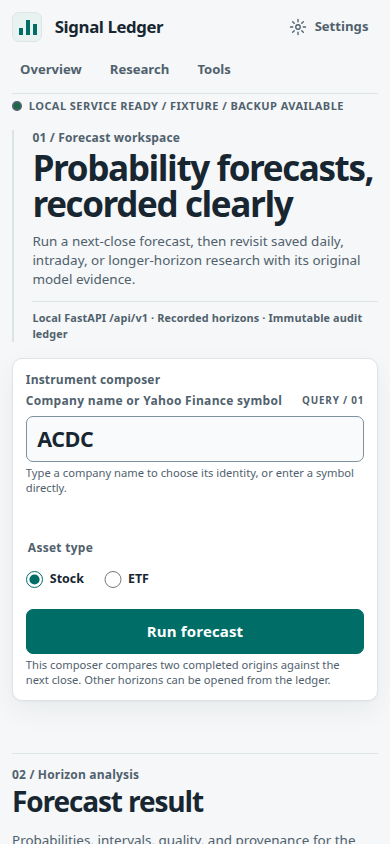</a></td>
    <td><a href="docs/images/readme/overview-mobile.png">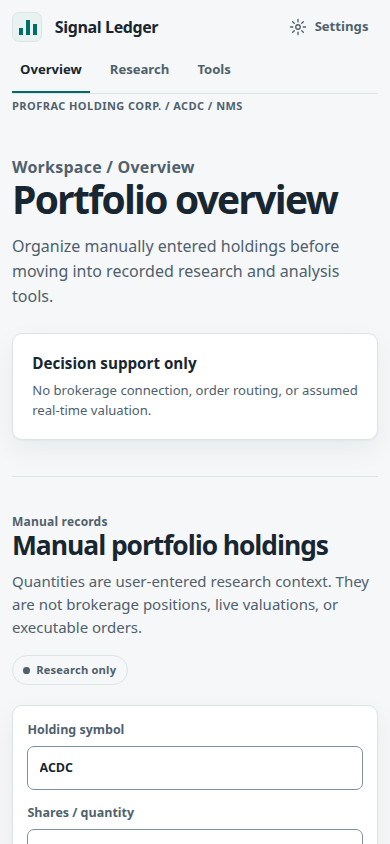</a></td>
    <td><a href="docs/images/readme/research-mobile.png">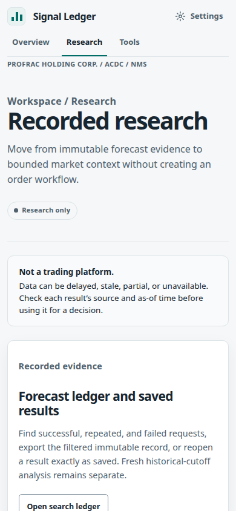</a></td>
    <td><a href="docs/images/readme/tools-mobile.png">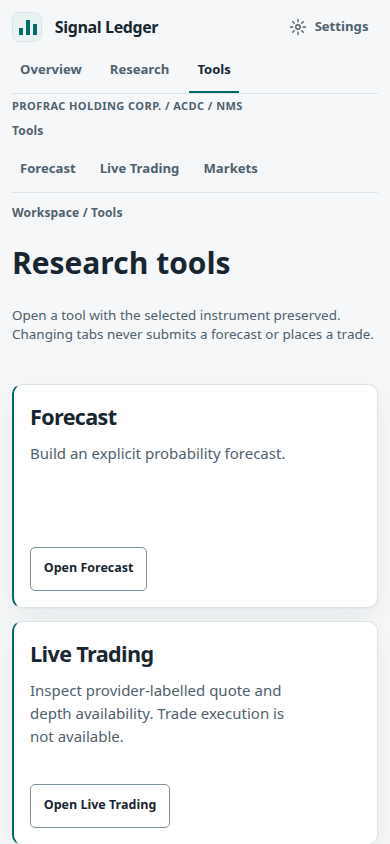</a></td>
  </tr>
  <tr>
    <th>Forecast</th>
    <th>Live Trading</th>
    <th>Markets</th>
    <th>API Docs</th>
  </tr>
  <tr>
    <td><a href="docs/images/readme/forecast-mobile.png">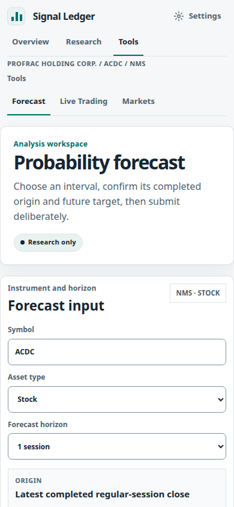</a></td>
    <td><a href="docs/images/readme/live-trading-mobile.png">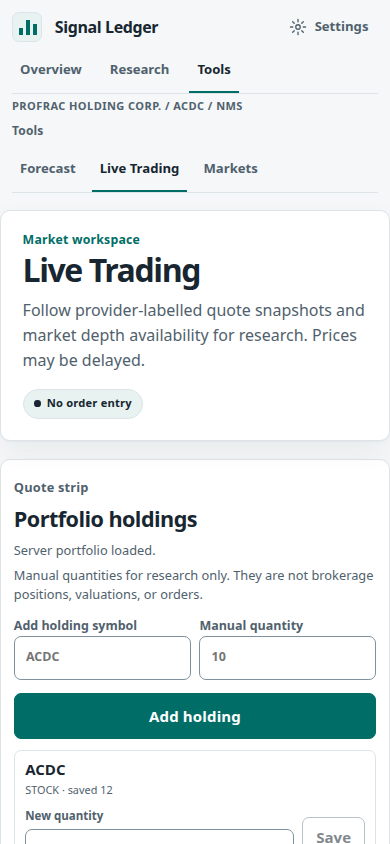</a></td>
    <td><a href="docs/images/readme/markets-mobile.png">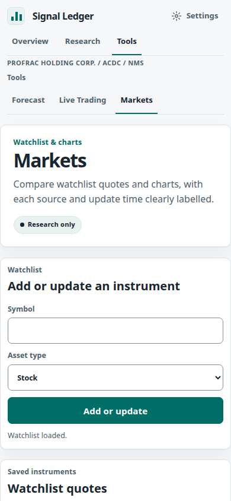</a></td>
    <td><a href="docs/images/readme/api-docs-mobile.png">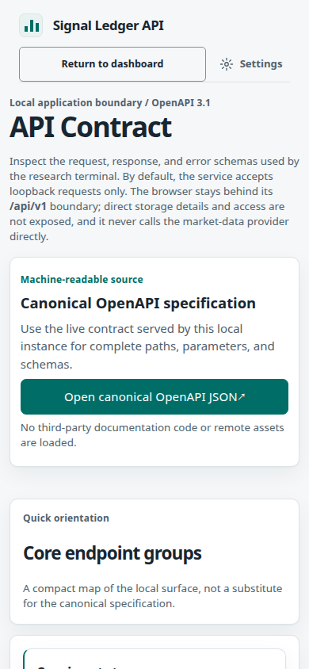</a></td>
  </tr>
</table>

## What you can do

- **Run explicit forecasts.** Search by company or symbol, confirm the full instrument identity,
  and choose a rolling horizon from five-minute forward through quarterly.
- **Read the evidence with the result.** Direction probabilities, threshold probabilities,
  empirical return and price intervals, samples, quality, model version, provider as-of time,
  and target boundaries stay together.
- **Keep an immutable ledger.** Reopen a saved forecast without another provider call, inspect
  later outcomes as append-only records, or run a separately labelled historical-cutoff analysis.
- **Add research context.** Maintain a small local portfolio and watchlist, inspect provider-
  labelled quote snapshots, and compare bounded daily charts.
- **Keep current headlines separate.** Headlines are an explicitly requested, ephemeral context
  panel. They do not change forecast inputs or enter the saved ledger.
- **Work comfortably across themes and sizes.** Light, Dark, and System themes, keyboard focus,
  reduced motion, print styling, and responsive layouts are part of the application surface.

## Quick start

The supported development path uses Python 3.11.15 and creates the isolated `.dev-venv/`
environment. From a checkout of this repository:

```bash
./scripts/bootstrap.sh
./scripts/build-frontend.sh
.dev-venv/bin/python -m stock_probs.cli migrate
.dev-venv/bin/python -m stock_probs.cli serve
```

Open [http://127.0.0.1:8000/](http://127.0.0.1:8000/) in a browser. The readiness endpoint is
available at [http://127.0.0.1:8000/api/v1/readiness](http://127.0.0.1:8000/api/v1/readiness),
and the local interactive API documentation is at
[http://127.0.0.1:8000/api/v1/docs](http://127.0.0.1:8000/api/v1/docs).

The default provider is Yahoo Finance and needs network access. For deterministic local work,
use the fixture configuration described in [local configuration](docs/configure/local-configuration.md).
The full startup, Compose, migration, and shutdown procedure is in
[Getting started](docs/operations/getting-started.md).

## Explore the workspace

| Route | Purpose |
| --- | --- |
| [`/`](docs/usage/dashboard.md) | Search instruments, run the original forecast comparison, and browse the ledger. |
| [`/overview`](docs/usage/dashboard.md) | Keep manually entered portfolio context visible. |
| [`/research`](docs/usage/dashboard.md) | Review recent recorded forecasts and compare saved results. |
| [`/tools`](docs/usage/dashboard.md) | Choose a research tool without submitting a request. |
| [`/tools/forecast`](docs/usage/dashboard.md) | Run one selected rolling-horizon forecast. |
| [`/tools/live-trading`](docs/usage/dashboard.md) | Inspect manual holdings and provider-labelled quote context. |
| [`/tools/markets`](docs/usage/dashboard.md) | Maintain a bounded watchlist, filter quotes, and inspect daily bars. |
| [`/api-docs`](docs/reference/api.md) | Open the browser's local API documentation page. |

The [dashboard guide](docs/usage/dashboard.md) explains instrument selection, forecast
semantics, saved replay, portfolio and watchlist context, headlines, themes, and ledger filters.
The `/api-docs` page points at the generated FastAPI contract at `/api/v1/docs`.

## Research boundaries

> Signal Ledger is a research application. Forecasts are informational outputs, not investment
> advice or a guarantee of future results.

Provider data is labelled with its source, as-of time, delay state, and any available quality
reason. Quote and chart surfaces use bounded snapshots and daily bars. The Live Trading page is
named for its compact research workspace; it has no order entry, execution, brokerage session,
or exchange-depth capability. News is fetched through the local API, held in a bounded in-memory
cache, and kept out of forecast inputs and persistence.

The browser talks to `/api/v1`; it never opens SQLite, receives a database path, or calls Yahoo
Finance directly. See [Architecture](docs/concepts/architecture.md) and the
[threat model](docs/security/threat-model.md) for the complete boundary description.

## Configuration

Most users can start with the defaults. The supported environment variables are documented in
[Local configuration](docs/configure/local-configuration.md), including:

- `STOCK_PROBS_PROVIDER=yahoo` for provider-backed requests, or `fixture` for deterministic local
  data.
- `STOCK_PROBS_DATA_DIR` for the local SQLite, backup, and trust-key directory.
- `STOCK_PROBS_HOST` and `STOCK_PROBS_PORT` for the loopback listener.
- `STOCK_PROBS_PROVIDER_TIMEOUT` for the bounded provider timeout.

For a local production-style container, use the root `compose.yaml` as described in
[Getting started](docs/operations/getting-started.md). It publishes the service on loopback and
keeps application data in a named volume.

## Private production deployment

The current authentication design is invite-only GitHub OAuth plus a six-digit code from an
authenticator app. Each user's holdings, watchlists, forecasts, exports, outcomes, and
reconstructions are scoped to that account. The authenticator code is the sole application second
factor, so signing in from a new phone or computer does not depend on Bluetooth or a passkey
manager. The deployed schema-10 migration revokes stored passkeys and old passkey sessions; Signal
Ledger does not create or accept WebAuthn credentials.

The R-ASTRA-103 implementation is the deployed authenticator-only baseline. R-ASTRA-107 is the
deployed enrollment key-reuse repair, R-ASTRA-108 introduced an app chooser before setup-key
generation, and R-ASTRA-109 adds Microsoft Authenticator with app-specific setup guidance.
Complete owner authentication remains pending. The
R-ASTRA-103 local gate passed: receipt `test-results/local-gates/R-ASTRA-103-20260928T235350Z/evidence.json` reports `707`
Python tests passed, `4` live tests deselected, `85.25%` coverage, frontend build/typecheck and
`27` frontend tests, and documentation coverage. Independent QA passed the authentication,
repository/list, API, backup/CLI, desktop/mobile-emulated auth-flow, frontend, migration, and
fresh schema-10 creation checks; Astra's medium source security review reported no P1/P2 finding.
The schema-9 predeploy backup remains an offline recovery artifact only.

The final-tree R-ASTRA-107 gate passed at pushed revision
`a2247cce6e9f55fc81f96da3698f424ae2a2dc20`: receipt
`test-results/local-gates/R-ASTRA-107-20261001T193724Z/evidence.json` records `763` Python tests,
`4` deselected, `85.45%` coverage, and frontend `28`, build, typecheck, and documentation checks
passing from `2026-10-01T19:37:24Z` to `19:47:25Z`. The release archive SHA-256 is
`85c53648c8c1810bfc37153c404d4064ee468c81ce78caaf0666e71bb5221106`; the Linux/amd64 image is
`sha256:b4249173085ef5b7b6c0df8741aa34d99e6b1d488ab9bfc829010398a422d2a1`, size `103160002` bytes,
and publisher re-download verification passed. Two MCP deployment plans returned
`remote_operation_failed`; fixed host-helper plan `105579dd822e69b03360201df2276bc3` then succeeded
and MCP deploy reached readiness schema `10`. Status reported revision `a2247cc`, `failed: null`,
`loopback_only: true`, backup `pre-deploy-a2247cce6e9f55fc-6ef1c2e6.spbackup`, and
`deployed_at=2026-10-01T19:58:26.230020Z`. The Terraform MCP applied operator CIDR
`50.21.67.178/32` to fixed firewall `177236117`.

Public HTTPS returned health `200`, auth status `200`, anonymous history `401`, and overview `303`
to sign-in, all with `no-store`/`DYNAMIC`. In the IAB, GitHub sign-in as `jtmb` reached authenticator
setup; repeated default starts across reload returned the same pending key when compared locally
without exposing it, and expiry plus explicit rotation controls were visible. No TOTP code was
entered, so owner enrollment and authenticated workspace retrieval remain **Unavailable**; physical
iPhone code validation is **Unavailable**. This is deployment evidence, not complete auth acceptance.

The current `R-ASTRA-109` follow-on adds Microsoft Authenticator to the chooser and displays its
setup guidance. The live selection flow passed, but no setup key or code was entered; the read-only
database check found zero owner factors and zero active pending enrollments. Owner code acceptance,
authenticated workspace retrieval, actual Microsoft Authenticator interaction, and physical iPhone
code acceptance remain **Unavailable**. See the [MVP plan](MVP-PLAN.md#microsoft-authenticator-dropdown-follow-on-r-astra-109)
for the evidence record. The preceding `R-ASTRA-108` chooser requires a selection before setup,
retains it through rotation, and guides manual entry or scanning with the selected app's QR reader;
it removes the generic `otpauth://` handler link.

The current `R-ASTRA-110` source follow-on refines the Microsoft Authenticator iOS route. It defaults
to same-phone manual key entry, keeps the QR hidden until **Another screen: scan from inside Microsoft
Authenticator** is selected, warns against iPhone Camera or Photos, and resets the method to manual
when the authenticator selection changes. SOL's scoped review and local enrollment protocol passed;
Luna focused browser QA passed `22/22` on desktop and emulated Pixel 7 with no overflow at mobile
`360px`. The earlier interrupted gates remain **Unavailable** as historical evidence, while the final
`TASK_ID=R-ASTRA-110 ./scripts/local-gate.sh check` passed with `763` tests, `4` deselected,
`85.47%` coverage, frontend `28`, and final backup `61` passed. Deployment, native Microsoft app
interaction, and physical iPhone routing remain pending or **Unavailable**. See the [R-ASTRA-110
evidence record](MVP-PLAN.md#microsoft-authenticator-ios-setup-routing-follow-on-r-astra-110).

The earlier deployment used reviewed revision `9cc0751da459e911d285b14e0d57a29320a9f366`. GitHub Release
`signal-ledger-9cc0751da459e911d285b14e0d57a29320a9f366` has archive SHA-256
`d60da545be26a050e305e13d2e8db219a253a0668b32f13f532148069bde188e`; publisher re-download passed.
The Linux/amd64 image is `103143811` bytes with ID
`sha256:3e5f242573044114797b66447e3a8139ed35ca7decc387e6f1ab3ef62db486ff`. Restricted MCP plan
`16c6655376c3b80569694ce400a2381c` passed and deployed readiness schema `10`; status reported
backup `pre-deploy-9cc0751da459e911-20833573.spbackup`, `deployed_at=2026-09-29T00:21:06.828904+00:00`,
`failed: null`, and `loopback_only: true`.

Live HTTPS at `00:22:18Z`–`00:22:19Z` returned health `200`, anonymous history `401`, overview
`303` to sign-in, and `no-store`/`DYNAMIC` responses. `/passkey?mode=verify` redirected `303` to
`/authenticator?mode=enroll&next=%2Foverview`. The IAB showed the revoked old session's `Sign in
first` state; fresh GitHub sign-in as `jtmb` rendered `Protect your account`, `Setup needed`, and
`Generate setup key` without a WebAuthn prompt. Owner TOTP enrollment, workspace content, saved
holdings, physical mobile, and second-user acceptance remain unavailable.

### Email invitations

Administrators can continue creating single-use invitation codes for private sharing or use the
optional SMTP email action when all six mail settings are configured. Every invite remains bound to
the numeric GitHub account ID; the recipient address is only for delivery. An SMTP-accepted
response does not confirm delivery. The current SMTP contract is implicit TLS on port `465` or
`2465`, or STARTTLS on port `587`. `R-ASTRA-104` scoped local QA and source review are recorded in
the [MVP plan](MVP-PLAN.md#current-email-invitation-follow-on-r-astra-104), while the transport and
operator-access follow-on is recorded at
[`R-ASTRA-106`](MVP-PLAN.md#current-deployment-access-and-invitation-transport-follow-on-r-astra-106).
Its local gate rerun passed for the declared scope: `731` Python tests, `4` deselected, `85.48%`
coverage, and frontend build/typecheck with `27/27` tests. The initial failed gate is retained in
the plan and superseded by that rerun. The later R-ASTRA-106 record covers the applied operator
firewall refresh and schema-10 production deployment. Resend domain/DNS preparation and Linode
TCP/TLS transport checks are recorded, but API-key creation, host installation, live sending,
mailbox delivery, owner TOTP enrollment, authenticated workspace retrieval, physical-mobile
evidence, and full production acceptance remain unavailable. See
[getting started](docs/operations/getting-started.md#invitation-email-and-host-compose-update) for
configuration and the fixed reviewed-Compose update procedure.

### Authenticator setup and recovery

After GitHub sign-in and invitation validation, an account without a TOTP factor goes directly to
`/authenticator?mode=enroll`. Choose an authenticator before generating a setup key. For Microsoft
Authenticator, the setup view defaults to **On this phone: copy the setup key**. In Microsoft
Authenticator, tap **+**, choose **Other account**, and use **Enter code manually** if offered.
Paste the key into that app and return to the page for its current six-digit code. If the page is
visible on another screen, select **Another screen: scan from inside Microsoft Authenticator** to
show a QR code for the app's own scanner. Do not use iPhone Camera or Photos: iOS may route the QR
to Apple Passwords, and there is no documented way in this flow to force those tools to open
Microsoft Authenticator. If you change the app selection and return to Microsoft Authenticator, the
page resets to manual entry; select the other-screen option again to reveal the QR.

For other selected apps, the QR code is generated locally in the browser from the short-lived
`otpauth://` setup URI and can be scanned from another screen with that app's in-app scanner. The
setup secret is not sent to an external QR service. The page does not offer a generic `otpauth://`
handler link because iOS may open a different app from the one selected. Confirm the current
six-digit code to activate the factor. Recovery codes are shown once, are single-use, and should be
stored offline.

If the authenticator is lost, use one unused recovery code to enter the restricted recovery flow,
then enroll a replacement authenticator. Recovery does not grant a normal workspace session until
the replacement factor is confirmed. An administrator must enter a fresh authenticator code before
creating a backup or promoting a restore; restore also revokes other sessions. The retired
`/passkey` route redirects to authenticator enrollment and cannot create or verify a passkey.

The `R-ASTRA-107` repair reuses an unexpired setup key only in the same session and origin,
preserving its expiry; **Start over with new key** explicitly rotates it and invalidates the old QR.
If a QR or setup key appears in a photo or screenshot, treat it as exposed: use **Start over with new
key** to rotate it, replace the old Signal Ledger entry in Apple Passwords with the new key before
entering its code, and do not use the captured QR or old key. Physical iOS verification remains **Unavailable**, and no TOTP code was entered in the deployment
check.

The app runs on one Linode with SQLite on a persistent private volume and is published only
through a Cloudflare Tunnel. The application port stays on `127.0.0.1`; the deployment helper
does not expose a public Docker port.

Build and publish the reviewed image locally:

```bash
./scripts/publish-production-image.sh
```

The default transport builds a Linux `amd64` image locally, scans the bounded archive for
credential material, and publishes a revision-named GitHub Release asset from the exact reviewed
`main` revision. The script treats that revision-named asset as immutable during its workflow,
then re-downloads it and verifies its archive SHA-256, image ID, revision, and platform before
returning the receipt; GitHub does not enforce asset immutability. Set
`SIGNAL_LEDGER_IMAGE_PUBLISH_MODE=ghcr` only when using the explicit GHCR compatibility transport;
GHCR is not the default. The Linode pulls the reviewed release asset through the local stdio
deployment MCP; the VM does not build source. The six typed operations are `inspect`,
`plan_deploy`, `deploy`, `status`, `rollback`, and `refresh_operator_access(operator_ipv4_cidr)`.
The last operation accepts one canonical IPv4 `/32` and is constrained to the fixed operator SSH
firewall rule through the reviewed Terraform source gate. See
[Getting started](docs/operations/getting-started.md) for the Terraform host setup, owner data
migration, tunnel canary, and recovery procedure.

The following deployment receipts preserve the prior schema-8 passkey rollout for traceability;
they are historical and do not establish a schema-9 TOTP deployment.

Terraform keeps the Linode firewall and application ports closed to the public, and Cloudflare
starts in a terminal-404 closed mode before the owner-only canary. E58 records the later
provider-refreshed `public_invited` boundary: the owner-canary Access app was deleted and the
exposure guard updated, while the tunnel, DNS, and cache bypass remained managed. The reviewed
image stays on the loopback-only replacement host, and direct port `8000` remains unreachable.
The live boundary returned `303` to local sign-in for `/overview`, `401` for `/api/v1/history`, and
`200` for `/api/v1/auth/status`; each was `no-store`/`DYNAMIC`. The live IAB showed the
unauthenticated sign-in page but no owner UI session. The prior private image was reviewed commit
`39bd185150cd3df70395e6c000f568dfd20831ac`, with release archive SHA-256
`930d6d5b5d054908a25825c980584b620817bfa7ab212a62abd63f65c72f6f3f` and image ID
`sha256:23ef16e4e5ee28db378c76bbcd9182345584bbffda55bd5313141fd0847fe31b`; publisher
re-download verification passed, and the typed MCP plan/deploy reached a healthy schema-8
loopback-only Linode with a pre-deploy backup. The auth UI repair passed frontend build/typecheck,
`28` tests, pinned Playwright desktop/mobile `2/2`, and independent Luna auth/passkey-cancellation
checks; Astra reported no remaining P1/P2 after its `409` guidance repair. GitHub OAuth application
authorization and the Access one-time-code flow completed, and the owner-only canary served the
new passkey text with Cloudflare unauthenticated traffic returning `302`. The earlier tab 13 showed
signed in as `jtmb` before this deployment, but may be stale; the new in-app-browser auth result was
not verified. Owner passkey enrollment and owner saved-data verification remain pending because the
browser requested a nearby phone/Bluetooth credential and no completed credential was observed. The
prior origin-navigation repair was reviewed at commit
`11faaf702129d0c1485a8683711d88340f623a71`; its release publisher SHA-256 is
`fad471b19db6ff4f9b4dc154055f0d2437128e49878e72a286b697f17e8a3f48` and image ID is
`sha256:26df706f6a2b4e76ee51bb014f94d39eb66bc7644a2c7a56eb3d012f41684d60`. MCP plan
`530c1c65a7b4563e9c7f1cdbf5a47a3d` deployed the ready schema-8 loopback-only image with a
pre-deploy backup; an external link from localhost:8765 to the canary passkey path loaded HTML
instead of the prior `origin_rejected` JSON. This verifies navigation only; it does not establish
current authentication, passkey enrollment, or saved-data access. A subsequent source fix at
commit `a1d868287a729c75d9b8628f612a856db132374a` handles stale/expired provisional sessions that
returned `authenticated:false` and left the passkey page at `Checking your session`; build/typecheck,
`28` frontend tests, and browser `4/4` passed. It is source-reviewed and locally tested and is
included in the final clean-main image below. The earlier private clean-main deployment used revision
`2de5e9f199cd145707f95e81d389c40b2ab3c32a`, archive SHA-256
`b856795831b6fb46e94e330370e003843b266ad85f22e8d95ef7624536b2ac48`, and image ID
`sha256:ae7991f35a2093b145245f8037a3227981b09051805467870f759c0752bbfc3d`. The first MCP plan
failed transiently with `remote_operation_failed` while the canary remained healthy; retry plan
`2d8b0fe91ed01b55f1625c27edcc620b` passed, and MCP deploy returned deployed/readiness schema `8`.
Status reported the current revision, `failed: null`, `loopback_only: true`, and pre-deploy backup
`pre-deploy-2de5e9f199cd1457-751c7459.spbackup`. A live in-app-browser reload with an expired
session showed `Sign in first` and `Open sign in` and hid `Create passkey`; opening sign-in and
continuing with GitHub returned to `/passkey?mode=enroll&next=/overview`, showed `Signed in as jtmb`,
and showed `Create passkey`. No ceremony was completed in this browser tab. E63 supersedes that image
with the published and deployed main revision `27e0d2f5916d4297e10d259aa4776055a78faeaa`, archive
SHA-256 `78f2e44ecfbe2021a61a0ecd71414065024c246eb46ca9506b33c20f13b07ad1`, and image ID
`sha256:ecd41e1b65eb76b424cff830a6150db2282d326cfb18b3b6eaa37b07f83c4bc0`; the publisher exited `0`,
and GitHub Release re-download verification passed; the retry MCP plan passed, and status is schema
`8`, `failed: null`, and loopback-only with
pre-deploy backup `pre-deploy-27e0d2f5916d4297-39376b8d.spbackup`. Public health/auth/sign-in probes
returned `200`/`200`/`401`/`303` with `no-store`/`DYNAMIC`. A post-deploy read-only SQLite check
reported `quick_check=ok`, zero foreign-key violations, 13 search events, 13 forecast runs, 20
forecast results, 6 holdings, 3 watchlist items, 1 passkey, and 1 user. The IAB passkey remained
unavailable with corrected error `The browser could not verify a passkey`; sign-out returned to
`/sign-in` with no account controls twice. E64's Astra live read-only review found no P1/P2, while
independently completed passkey, browser-rendered owner workspace, and live second-user onboarding
remain **Unavailable**. A read-only operator
SQLite check on `2026-09-28` (exact query UTC not captured) found `quick_check` `ok`, zero foreign-
key violations, owner id `1` claimed to the configured GitHub account as active admin, one
nonrevoked passkey, one current passkey-verified session, and owner mappings of 13 events, 13 runs,
20 results, 0 outcomes, 6 holdings, and 3 watchlist items. This proves enrollment, a completed
passkey verification on another computer, and persisted owner mappings; it does not prove
authenticated browser-rendered UI retrieval. A fresh production tab hit Cloudflare Access login with
no transferable browser session. E55's later read-only Docker access logs observed authenticated owner API
retrieval and saved-forecast access after the passkey session; `/overview`, portfolio, watchlist,
history, and saved-forecast requests returned `200`. Browser-rendered content remains **Unavailable**.
E56 independently passes the four two-client isolation scenarios locally, including cross-watchlist
deletion, member `promote=true` restore denial, nested outcome export, and two-account invitation
reuse/identity binding. E57's rerun of the full local gate also passed after its initial comment-audit
failure. E58 makes the public-invited infrastructure boundary live. E59 retires the legacy Linode
and confirms the replacement is running. E60 records the historical current-machine browser passkey
and sign-out limitation; E61 records the locally accepted logout and mode-aware passkey repair with
independent QA, and E62 records the passing full local gate. E63 publishes and deploys the current
main image, verifies public health/auth/sign-in probes, and records a post-deploy read-only SQLite
check matching the preserved owner data. The IAB passkey remains unavailable, while corrected sign-out
returns to sign-in twice. E64 records Astra's live read-only review with no P1/P2. Browser-rendered
owner content, live second-user onboarding, and hardware passkey evidence remain **Unavailable**.
Remote two-user behavior and functional invited-user acceptance remain **Unavailable**; this is not a
full production acceptance claim. Server-observed owner verification and saved API retrieval remain
recorded in E52/E55.
See
[Getting started](docs/operations/getting-started.md)
for the current Terraform, recovery, and canary boundaries.

## Development

Read [developer testing](docs/develop/testing.md) for the deterministic Python, frontend,
browser, package, backup, and local-gate checks. The common local commands are:

```bash
./scripts/bootstrap.sh
./scripts/build-frontend.sh
make check
make browser-test
```

Changes to authored documentation should follow the [documentation workflow](docs/develop/documentation.md).
The [architecture guide](docs/concepts/architecture.md), [forecast model](docs/concepts/forecast-model.md),
and [API reference](docs/reference/api.md) are the best places to understand the system before
changing it. Please keep examples local and deterministic, preserve provider and provenance
labels, and do not add credentials or private machine paths to tracked files.

## Project records

The landing page stays deliberately short. The authoritative contract, dependency order, and
evidence history live in the root records:

- [MVP plan](MVP-PLAN.md) — product contract, task register, and evidence ledger.
- [MVP roadmap](MVP-ROADMAP.md) — milestone ordering and status summary.
- [AGENTS.md](AGENTS.md) — repository ownership, evidence, and local-workflow rules.
- [Documentation index](docs/index.md) — authored guides by topic.

## License

No root `LICENSE` file or open-source license has been declared yet. Until a license is added,
the repository should not be treated as granting permission to reuse, modify, or redistribute the
code.
