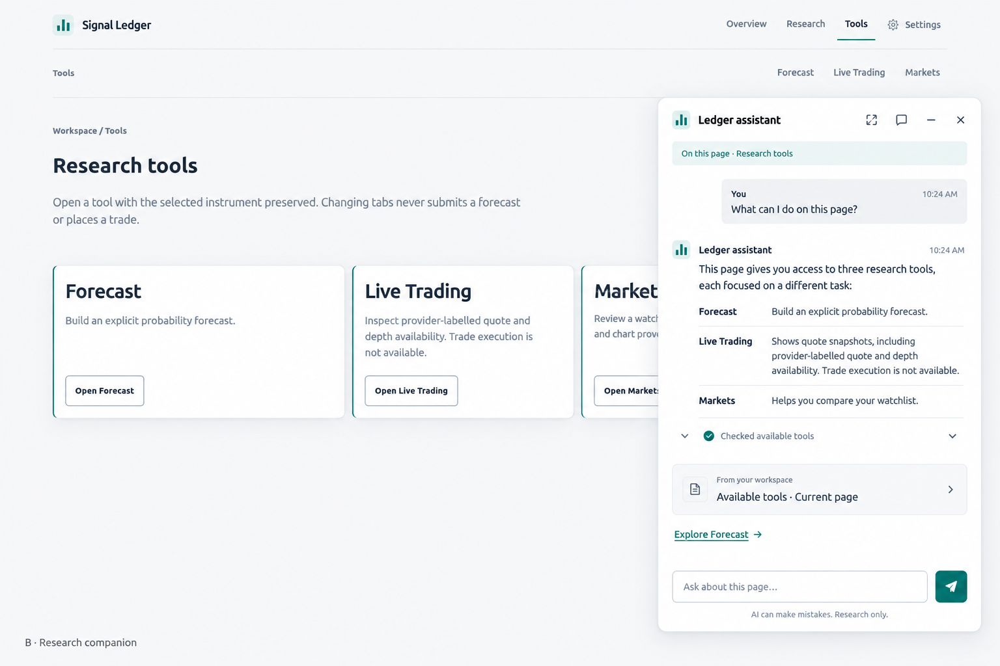
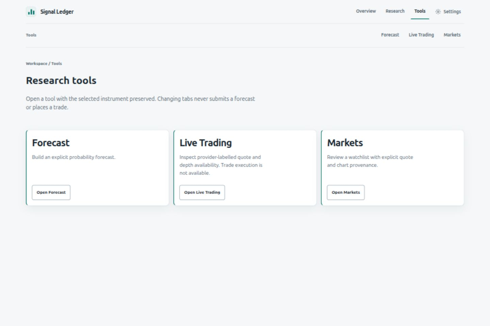

# Design system and Ledger assistant

This guide describes the visual system already used by Signal Ledger and the approved design for
the Ledger assistant. It is a planning artifact; source implementation remains pending. It is not
evidence that an assistant has shipped or that any assistant behavior has passed runtime,
accessibility, or browser checks.

## Source of truth

The packaged workspace stylesheet, [`app.css`](../../src/stock_probs/static/app.css), defines the
current color, type, surface, focus, reduced-motion, forced-colors, and print behavior. The Next.js
workspace uses the same packaged stylesheet through [`layout.tsx`](../../frontend/app/layout.tsx).
Shared route navigation and its selected-page state are defined in
[`workspace-nav.tsx`](../../frontend/components/workspace-nav.tsx); the Tools layout and page
provide the baseline composition in [`tools/layout.tsx`](../../frontend/app/tools/layout.tsx) and
[`tools/page.tsx`](../../frontend/app/tools/page.tsx).

When this guide and the current source differ, treat source as the evidence for current behavior.
Keep the guide current when an intentional shared visual change is made. Proposed assistant styling
must use the existing system unless an approved implementation requirement changes it.

## Current visual language

Signal Ledger uses a quiet research-workspace presentation: cool neutral page and panel surfaces,
dark readable text, restrained teal accents, clear borders, and a small number of semantic status
colors. Navigation and selected instrument context stay visible across workspace routes. The Tools
page groups Forecast, Live Trading, and Markets as separate work areas. Its page tabs only navigate;
changing tabs does not submit a forecast or place a trade.

| Role | Light theme | Dark theme | Use |
| --- | --- | --- | --- |
| Canvas | `#f5f7f8` | `#0d141a` | Main page background |
| Panel | `#ffffff` | `#17212a` | Cards, menus, and assistant surfaces |
| Raised panel | `#ffffff` | `#1b2730` | Emphasized cards and floating surfaces |
| Main text | `#172630` | `#eff4f6` | Headings and primary content |
| Muted text | `#50616d` | `#a9bac4` | Supporting copy and metadata |
| Accent | `#006e67` | `#7bc9c1` | Selected navigation, primary action, links |
| Border | `#dce4e8` | `#34434d` | Grouping and separation |
| Focus | `#007f75` | `#80ded4` | Visible keyboard focus |

Use the existing CSS custom properties (`--canvas`, `--panel`, `--panel-raised`, `--text`,
`--muted`, `--accent`, `--border`, and `--focus`) rather than copying color literals into a new
component. Positive, warning, and failure states use the existing semantic `--good`, `--warn`, and
`--bad` roles. Do not encode a state by color alone.

Typography uses the system sans-serif stack and a 16 px root size. Body copy is compact and readable;
large workspace headings use responsive sizing and close line spacing. Numeric values use tabular
figures. Panels use the shared 10 px radius and restrained shadow. Borders, spacing, and headings
provide hierarchy; avoid adding decorative chrome or a second brand palette.

## Approved Ledger assistant concept

The approved direction is concept B: a Ledger assistant that can explain the current workspace and
offer research help while leaving the selected page and its data visible when space permits. It
should feel like another Signal Ledger surface, not an unrelated chat product.

The following image is the existing Tools page captured without the assistant. It is the visual
baseline for comparison, not evidence that the assistant is present in the application.

### Desktop panel

- Do not open the assistant automatically on page load. Provide a visible, keyboard-operable
  launcher; activating it opens the assistant. The assistant may be collapsed and reopened without
  losing the current page context.
- At a 700 px viewport width or wider, show an approximately 480 px wide panel fixed to the bottom-right
  of the viewport. Bound its height to the available dynamic viewport and scroll its message area
  internally so the header and composer remain reachable.
- Keep the underlying workspace visible and usable. Do not add a page-dimming backdrop, modal
  scrim, or desktop focus trap. Respect viewport edges and keep controls out of system insets.
- Give the header clear controls for assistant title/context, model choice, history, expand or
  restore size, collapse, and close. Every icon-only control needs an accessible name and a 44 px
  minimum target.

### Small screens and on-screen keyboard

At widths below 700 px, the assistant becomes a full-screen surface with safe-area padding. It must
account for the on-screen keyboard and changing visual viewport so the composer and send control
remain visible while typing. Keep the message list independently scrollable and do not place
essential controls beneath browser chrome or device cutouts. On return to the page, restore the
user's prior context and focus to the assistant launcher.

### Conversation structure and states

- Use a clear header and ordered conversation history, with visually distinct user and assistant
  turns. Keep content text selectable and support readable long responses, lists, citations, and
  structured action previews.
- Show the active page or selected instrument as context when it is actually available. Let the user
  remove or change that context; do not imply the assistant can see data it was not given.
- Provide an explicit model picker. Show the selected model and its availability, and do not claim a
  model is ready when runtime discovery or a request is unavailable.
- Provide a history control with honest loading, empty, failure, and selected-conversation states.
  Do not imply cross-device or durable history unless the implemented storage contract supports it.
- Citations must identify the source and relevant date/as-of value when available. Link to the
  underlying first-party page or local workspace record only when that destination exists. Mark
  unavailable citations as unavailable rather than presenting fabricated links.
- Show tool activity as visible, named steps with pending, complete, and failed states. Summaries
  must distinguish retrieved evidence from assistant explanation and preserve provider/source
  attribution.
- Before an assistant-suggested action is applied, show a preview of its scope and expected effect
  and require the user to confirm. A preview is not an action result. Assistant copy must not imply
  that Signal Ledger places trades; trade execution is unavailable in the existing Tools contract.
- Include clear loading, empty, unavailable, error, and cancellation states. Keep status updates
  available to assistive technology without moving focus unexpectedly.

### Accessibility and display modes

- Make every action keyboard-operable. Maintain a logical reading and tab order, provide a visible
  `:focus-visible` treatment, and keep focus from being obscured by the panel edge or composer.
- Escape closes or collapses the panel when safe; on the full-screen small-screen surface it exits
  to the workspace and restores focus to the launcher. If an action preview is open, Escape first
  dismisses the preview without applying it.
- Use semantic headings, labelled controls, ordered messages, and status announcements. Do not rely
  on color, icons, or animation alone to convey state.
- Preserve the existing light, dark, and system theme behavior by consuming shared semantic tokens.
  Meet the application's text, control, chart, and focus contrast requirements in both themes.
- Honor `prefers-reduced-motion`; transitions must not be needed to understand state or complete an
  action. Under forced colors, retain clear borders, focus, selected state, and control labels
  without depending on shadows or background tints.
- In print, omit interactive assistant controls and retain only content that has a meaningful
  printed representation. Avoid printing hidden controls or decorative chat chrome.

## Review checklist for future UI work

Before changing a workspace or building on the assistant, inspect this guide and the current
packaged styles and route components. Check the implementation at desktop and narrow mobile widths,
in light and dark themes, with keyboard-only navigation, reduced motion, forced colors, and print
styles. Record what was actually exercised and retain failed, skipped, pending, or unavailable
results as such.

Keep proposed mockups, current product screenshots, implementation, and acceptance evidence
distinct. A concept image establishes the approved visual direction only; a current-page screenshot
shows only the captured baseline; neither proves a running implementation or acceptance result.

[Back to Develop](index.md)
