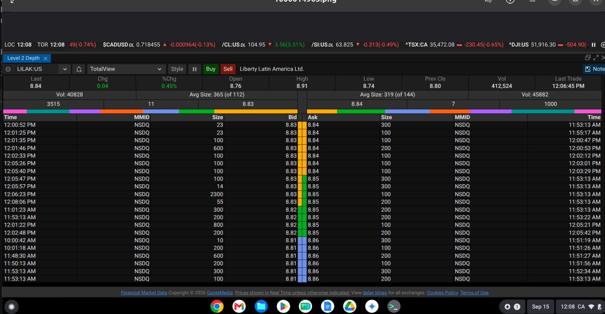

Ok lets add to the roadmap items and update the mvp-plan.

DO nothing but the requested above. Do not clear current roadmap items. Do not clear current to-dos, add to them. Make me a concrete plan. Use websearch where necessary to clear knowledge gaps. Please consume the "Intention/Goal for context". Build the bellow tasks with this context in mind.

Intention/Goal for context:  Currently we have built a stock prediction tool that predicts the probability of a stock up or down. We increasing the scope to make this application run more like a trading platform. Not to trade but to provide all other tools and research to make the trade. As an example, we going to use Scotiabank iTrade PRO platform as a template. With the same menu items mainly: Overview, Research and thirdly Tools. So the current prediction tool would fall under Tools.

0. Ensure all tabs bellow are listed as tools in the navigation.

1. Add a stock price forcast based on the probalities.Ensure live market data is used, please allow the user to configure the forecast interval input in a beautifull way that fits the current design, is user intuitive and makes sense. The forecast options should be ideally a drop down menu for 5 min, daily, weekly, monthly, quarterly - what is the probability of the price going up and down. 

2. Live Trading screen. Please see screenshot for example. i want live trading to show live stock quotes. For the live scrolling quotes ask to input the users custom portfolio and then scroll those price quotes for the stocks that are in the portfolio (live data). Please ensure you provide the total view as per the screenshot, i want features to reamin intact based on the screenshot. 

3. Ensure the live trading screen and the forecast are seperate tabs on the UI. they should have seperate endpoints in the API as well. Re-use only when necessary. Make it user friendly, think about user interactions and how to make the transition between both tabs seamless and integrate into the workflow of someone who trades stocks. This should operate like a workspace in your browser.

4. Make another tab called "Markets" add a User watchlist for specific stocks with all the data live being able to click through each saved stock and seing all the data. Taking heavy influence from "scotia itrade". Ensure you inclide live graphs and filters.Please see screenshots of scotia itrade.

